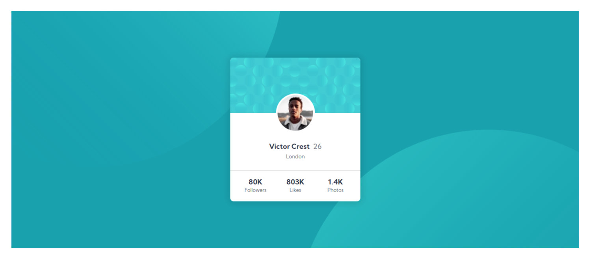

# Frontend Mentor - Profile card component solution

This is a solution to the [Profile card component challenge on Frontend Mentor](https://www.frontendmentor.io/challenges/profile-card-component-cfArpWshJ). Frontend Mentor challenges help you improve your coding skills by building realistic projects. 

## Table of contents

- [Overview](#overview)
  - [The challenge](#the-challenge)
  - [Screenshot](#screenshot)
  - [Links](#links)
- [My process](#my-process)
  - [Built with](#built-with)
  - [What I learned](#what-i-learned)
- [Author](#author)

## Overview

### The challenge

Users should be able to:

- View the optimal layout for the component depending on their device's screen size
- See a hover state on desktop for the Sign Up call-to-action

### Screenshot



### Links

- Solution URL: [https://github.com/pawelgp/profile-card-component](https://github.com/pawelgp/profile-card-component)
- Live Site URL: [https://pawelgp.github.io/profile-card-component/](https://pawelgp.github.io/profile-card-component/)

## My process

### Built with

- HTML5,
- SASS (Dart),
- BEM,
- DRY.

### What I have learnt


SVG icons are simply implemented in IMG tag.
```html

```

The mixin to keep aspect ratio, where present values read from svg file:
```css
@mixin card-icon($present_width: 64, $present_height: 40, $desired_height: 3rem){
  height: #{$desired_height};
  margin-right: calc(100% - #{$desired_height} * #{$present_width} / #{$present_height});
}
```
## Author

- Website - [over40.pl](https://over40.pl)
- Twitter - [@pgpasich](https://www.twitter.com/pgpasich)